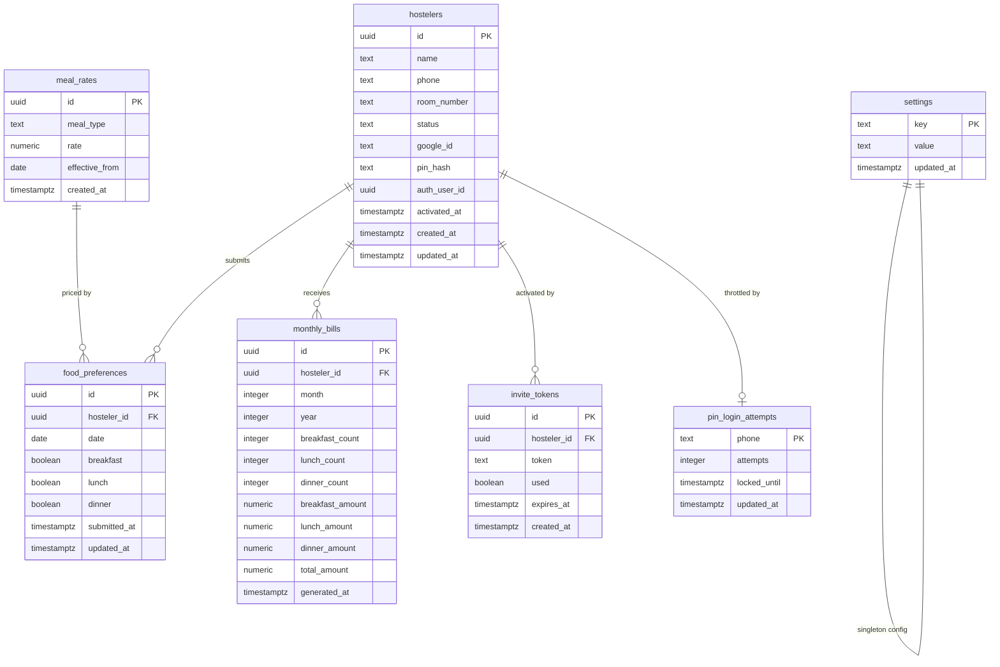

# Data Model: Deekshana Castle PG Management App

**Phase**: 1 — Design & Contracts | **Date**: 2026-07-03

## Entity Relationship Overview



## Entities

### 1. `hostelers`

The core user entity representing a paying guest.

| Column | Type | Constraints | Description |
|--------|------|-------------|-------------|
| `id` | uuid | PK, default `gen_random_uuid()` | Unique identifier |
| `name` | text | NOT NULL | Full name |
| `phone` | text | NOT NULL, UNIQUE | Phone number (Indian format) |
| `room_number` | text | NOT NULL | Room identifier |
| `status` | text | NOT NULL, CHECK IN ('pending','active','inactive') | Lifecycle status |
| `google_id` | text | UNIQUE, NULLABLE | Google OAuth subject ID |
| `pin_hash` | text | NULLABLE | bcryptjs hash of 4-digit PIN |
| `auth_user_id` | uuid | UNIQUE, NULLABLE, FK → auth.users | Supabase Auth user link |
| `activated_at` | timestamptz | NULLABLE | When account was activated |
| `created_at` | timestamptz | NOT NULL, default `now()` | Record creation time |
| `updated_at` | timestamptz | NOT NULL, default `now()` | Last modification time |

**Validation rules**:
- `phone`: Must match pattern `^[6-9]\d{9}$` (10-digit Indian mobile)
- `status`: Enum constraint — only 'pending', 'active', 'inactive' allowed
- `pin_hash`: Present only if hosteler chose PIN activation path
- `google_id`: Present only if hosteler activated via Google OAuth
- At least one of `google_id` or `pin_hash` must be set when `status = 'active'`

**State transitions**:
```
pending → active    (via invite activation: Google OAuth or PIN setup)
active → inactive   (owner deactivates)
inactive → active   (owner reactivates)
```

**Indexes**:
- `idx_hostelers_phone` on `phone` (login lookup)
- `idx_hostelers_google_id` on `google_id` (OAuth lookup)
- `idx_hostelers_status` on `status` (owner filtering)
- `idx_hostelers_auth_user_id` on `auth_user_id` (RLS policy)

---

### 2. `invite_tokens`

Time-limited activation credentials generated by the owner.

| Column | Type | Constraints | Description |
|--------|------|-------------|-------------|
| `id` | uuid | PK, default `gen_random_uuid()` | Unique identifier |
| `hosteler_id` | uuid | NOT NULL, FK → hostelers(id) | Target hosteler |
| `token` | text | NOT NULL, UNIQUE | Random UUID token value |
| `used` | boolean | NOT NULL, default `false` | Whether token has been consumed |
| `expires_at` | timestamptz | NOT NULL | Expiration (created_at + 7 days) |
| `created_at` | timestamptz | NOT NULL, default `now()` | Generation time |

**Validation rules**:
- `token`: Generated via `crypto.randomUUID()` — never sequential
- `expires_at`: Automatically set to `created_at + INTERVAL '7 days'`
- A token is valid only when: `used = false AND expires_at > now()`
- When a new token is generated for a hosteler, previous unused tokens are invalidated (`used = true`)

**Indexes**:
- `idx_invite_tokens_token` on `token` (activation lookup)
- `idx_invite_tokens_hosteler_id` on `hosteler_id`

---

### 3. `food_preferences`

Daily meal selections submitted by hostelers.

| Column | Type | Constraints | Description |
|--------|------|-------------|-------------|
| `id` | uuid | PK, default `gen_random_uuid()` | Unique identifier |
| `hosteler_id` | uuid | NOT NULL, FK → hostelers(id) | Submitting hosteler |
| `date` | date | NOT NULL | The date the meals are for (always "tomorrow") |
| `breakfast` | boolean | NOT NULL, default `false` | Opted for breakfast |
| `lunch` | boolean | NOT NULL, default `false` | Opted for lunch |
| `dinner` | boolean | NOT NULL, default `false` | Opted for dinner |
| `submitted_at` | timestamptz | NOT NULL, default `now()` | First submission time |
| `updated_at` | timestamptz | NOT NULL, default `now()` | Last update time |

**Validation rules**:
- UNIQUE constraint on `(hosteler_id, date)` — one record per hosteler per day
- Write operations use UPSERT: `INSERT ... ON CONFLICT (hosteler_id, date) DO UPDATE`
- `date` must be tomorrow (server-validated); same-day or past-date writes rejected
- Writes rejected if current IST time > `settings.deadline_time`

**Indexes**:
- `idx_food_preferences_hosteler_date` UNIQUE on `(hosteler_id, date)` (upsert + lookup)
- `idx_food_preferences_date` on `date` (owner dashboard count queries)

---

### 4. `meal_rates`

Historical per-meal pricing, supporting mid-month rate changes.

| Column | Type | Constraints | Description |
|--------|------|-------------|-------------|
| `id` | uuid | PK, default `gen_random_uuid()` | Unique identifier |
| `meal_type` | text | NOT NULL, CHECK IN ('breakfast','lunch','dinner') | Meal category |
| `rate` | numeric(10,2) | NOT NULL, CHECK > 0 | Price per day (INR) |
| `effective_from` | date | NOT NULL | First day this rate applies |
| `created_at` | timestamptz | NOT NULL, default `now()` | Record creation time |

**Validation rules**:
- UNIQUE constraint on `(meal_type, effective_from)` — one rate per meal per effective date
- `effective_from` for new rates = tomorrow's date (spec: "takes effect from the NEXT calendar day")
- `rate` must be positive
- Default rates at launch: breakfast ₹30, lunch ₹50, dinner ₹40

**Rate lookup logic**: For any given day, the applicable rate is the most recent `meal_rates` row where `effective_from <= target_day`, ordered by `effective_from DESC`, limited to 1.

**Indexes**:
- `idx_meal_rates_type_effective` on `(meal_type, effective_from DESC)` (rate lookup)

---

### 5. `monthly_bills`

Computed billing records, generated on demand by the owner.

| Column | Type | Constraints | Description |
|--------|------|-------------|-------------|
| `id` | uuid | PK, default `gen_random_uuid()` | Unique identifier |
| `hosteler_id` | uuid | NOT NULL, FK → hostelers(id) | Billed hosteler |
| `month` | integer | NOT NULL, CHECK 1-12 | Billing month |
| `year` | integer | NOT NULL, CHECK 2024-2100 | Billing year |
| `breakfast_count` | integer | NOT NULL, default 0 | Days breakfast was opted |
| `lunch_count` | integer | NOT NULL, default 0 | Days lunch was opted |
| `dinner_count` | integer | NOT NULL, default 0 | Days dinner was opted |
| `breakfast_amount` | numeric(10,2) | NOT NULL, default 0 | Total breakfast charge |
| `lunch_amount` | numeric(10,2) | NOT NULL, default 0 | Total lunch charge |
| `dinner_amount` | numeric(10,2) | NOT NULL, default 0 | Total dinner charge |
| `total_amount` | numeric(10,2) | NOT NULL, default 0 | Sum of all meal amounts |
| `generated_at` | timestamptz | NOT NULL, default `now()` | When bill was computed |

**Validation rules**:
- UNIQUE constraint on `(hosteler_id, month, year)` — one bill per hosteler per month
- Regeneration replaces existing bill (UPSERT on conflict)
- `total_amount = breakfast_amount + lunch_amount + dinner_amount`
- Amounts computed as sum of (opted_day × applicable_rate_for_that_day) per meal type

**Indexes**:
- `idx_monthly_bills_hosteler_month_year` UNIQUE on `(hosteler_id, month, year)`
- `idx_monthly_bills_month_year` on `(month, year)` (owner views all bills for a month)

---

### 6. `pin_login_attempts`

Tracks consecutive failed PIN login attempts for brute-force protection (FR-006a).

| Column | Type | Constraints | Description |
|--------|------|-------------|-------------|
| `phone` | text | PK | Phone number being throttled |
| `attempts` | integer | NOT NULL, default 0 | Consecutive failed attempts since last reset |
| `locked_until` | timestamptz | NULLABLE | If set and in future, login is blocked |
| `updated_at` | timestamptz | NOT NULL, default `now()` | Last attempt time |

**Validation rules**:
- After 5 consecutive failures (`attempts >= 5`), set `locked_until = now() + INTERVAL '15 minutes'`
- On successful login: delete the row (reset counter)
- On any attempt when `locked_until > now()`: reject immediately with HTTP 429
- After cooldown elapses (`locked_until <= now()`): reset `attempts = 0` and allow login
- Row is also cleared when the hosteler's account is deactivated

**Indexes**:
- PK on `phone` (direct lookup during PIN verify)

---

### 7. `settings`

Key-value store for system configuration.

| Column | Type | Constraints | Description |
|--------|------|-------------|-------------|
| `key` | text | PK | Setting identifier |
| `value` | text | NOT NULL | Setting value (stored as text, parsed by application) |
| `updated_at` | timestamptz | NOT NULL, default `now()` | Last modification time |

**Seed data**:
| Key | Default Value | Description |
|-----|---------------|-------------|
| `deadline_time` | `21:00` | Daily submission deadline (HH:MM in IST) |

---

## Non-Persistent PWA Artifacts

The true PWA requirements do not introduce new Supabase tables or persisted domain entities. They are represented by browser-managed installation state, public static assets, and service worker cache state.

| Artifact | Owner | Required fields/state | Validation |
|----------|-------|-----------------------|------------|
| Web app manifest | `public/manifest.json` | `name`, `short_name`, `start_url`, `scope`, `display: "standalone"`, `theme_color`, `background_color`, icons including 192x192, 512x512, and maskable support | Automated manifest and icon metadata checks |
| Launcher icons | `public/icons/` | Android-suitable PNG icons, including maskable variants for safe launcher cropping | Automated metadata checks plus Android app drawer inspection |
| Service worker cache | Generated service worker/runtime cache | Core app shell assets for layout, navigation, login entry points, hosteler shell, and owner shell | Automated offline app-shell test |
| Install prompt state | Browser session state in install UI component | Deferred `beforeinstallprompt` event availability, accepted/dismissed outcome, `appinstalled`, and standalone display mode | Automated component/browser behavior where supported; manual Android install validation |
| Offline UI state | Browser network status and failed data requests | Explicit offline state for data-dependent actions; no blank or broken pages | Automated offline-shell scenario plus manual installed-PWA offline launch |

No business data is cached as authoritative offline state in v1. Food submissions, dashboard counts, settings, billing, and history remain server-backed and require connectivity for fresh reads or writes.

---

## Row Level Security Policies

### `hostelers`
- **SELECT**: Authenticated users can read their own row (`auth.uid() = auth_user_id`); owner can read all
- **INSERT**: Owner only (service role via API)
- **UPDATE**: Owner only (status changes, reactivation)

### `invite_tokens`
- **SELECT**: Public (needed for activation page to validate token)
- **INSERT**: Owner only
- **UPDATE**: Authenticated (to mark as used during activation)

### `food_preferences`
- **SELECT**: Hostelers see own rows; owner sees all
- **INSERT/UPDATE**: Hosteler can write own rows only (enforced by `hosteler_id = auth.uid()` mapped via `hostelers.auth_user_id`)
- **DELETE**: None (no deletion, only upsert)

### `meal_rates`
- **SELECT**: All authenticated users (hostelers need rates for bill display)
- **INSERT/UPDATE**: Owner only

### `monthly_bills`
- **SELECT**: Hostelers see own bills; owner sees all
- **INSERT/UPDATE**: Owner only (generated via service role API)

### `settings`
- **SELECT**: All authenticated users (deadline time needed by client)
- **UPDATE**: Owner only

---

## Supabase Realtime Configuration

Enable Realtime on `food_preferences` table for the owner dashboard:
- Publication: `supabase_realtime` includes `food_preferences`
- Channel filter: `date=eq.{tomorrow_date}` to limit events to relevant submissions
