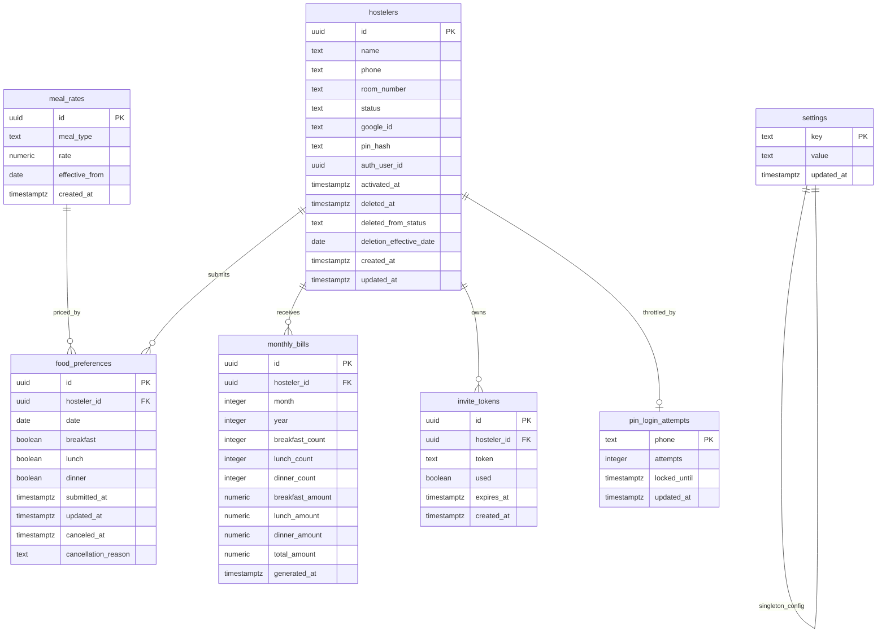

# Data Model: Deekshana Castle PG Management App

**Phase**: 1 — Design & Contracts | **Date**: 2026-07-05

## Entity Relationship Overview



## Modeling Note

The spec's deleted hosteler record is modeled as the same `hostelers` row moved into `status = 'deleted'` with deletion metadata. This preserves links to historical food and billing data without introducing a separate archive service or duplicate identity records. Canceled future-dated food-preference rows remain attached to that identity strictly for deleted-hosteler audit detail retrieval; they are not part of normal owner history/export, dashboard, or billing datasets.

## Entities

### 1. `hostelers`

Core identity and lifecycle record for a hosteler.

| Column | Type | Constraints | Description |
|--------|------|-------------|-------------|
| `id` | uuid | PK, default `gen_random_uuid()` | Unique identifier |
| `name` | text | NOT NULL | Full name |
| `phone` | text | NOT NULL, UNIQUE | Phone number (Indian format) |
| `room_number` | text | NOT NULL | Room identifier |
| `status` | text | NOT NULL, CHECK IN ('pending','active','inactive','deleted') | Lifecycle status |
| `google_id` | text | UNIQUE, NULLABLE | Google OAuth subject ID |
| `pin_hash` | text | NULLABLE | bcryptjs hash of 4-digit PIN |
| `auth_user_id` | uuid | UNIQUE, NULLABLE, FK -> auth.users | Supabase Auth user link |
| `activated_at` | timestamptz | NULLABLE | When account was activated |
| `deleted_at` | timestamptz | NULLABLE | When the owner deleted the hosteler |
| `deleted_from_status` | text | NULLABLE, CHECK IN ('pending','active') | Which live status was deleted |
| `deletion_effective_date` | date | NULLABLE | IST calendar date used to preserve same-day history and cancel later dates |
| `created_at` | timestamptz | NOT NULL, default `now()` | Record creation time |
| `updated_at` | timestamptz | NOT NULL, default `now()` | Last modification time |

**Validation rules**:
- `phone` must match `^[6-9]\d{9}$`.
- `status = 'active'` requires at least one of `google_id` or `pin_hash`.
- `status = 'deleted'` requires `deleted_at`, `deleted_from_status`, and `deletion_effective_date`.
- `deleted_from_status` may only be `pending` or `active` because v1.2 allows delete only from those states.
- Deleted rows remain owner-visible and are excluded from hosteler-authenticated access.

**State transitions**:
```text
pending -> active     (invite activation)
active -> inactive    (owner deactivates)
inactive -> active    (owner reactivates)
pending -> deleted    (owner deletes pending hosteler)
active -> deleted     (owner deletes active hosteler)
```

**Indexes**:
- `idx_hostelers_phone` on `phone`
- `idx_hostelers_google_id` on `google_id`
- `idx_hostelers_status` on `status`
- `idx_hostelers_deleted_at` on `deleted_at`
- `idx_hostelers_auth_user_id` on `auth_user_id`

---

### 2. `invite_tokens`

Time-limited activation credentials generated by the owner.

| Column | Type | Constraints | Description |
|--------|------|-------------|-------------|
| `id` | uuid | PK, default `gen_random_uuid()` | Unique identifier |
| `hosteler_id` | uuid | NOT NULL, FK -> hostelers(id) | Target hosteler |
| `token` | text | NOT NULL, UNIQUE | Random UUID token value |
| `used` | boolean | NOT NULL, default `false` | Whether token has been consumed or invalidated |
| `expires_at` | timestamptz | NOT NULL | Expiration timestamp |
| `created_at` | timestamptz | NOT NULL, default `now()` | Generation time (contract alias: `generated_at`) |

**Validation rules**:
- `token` is generated via `crypto.randomUUID()`.
- Token is valid only when `used = false` and `expires_at > now()`.
- Resetting an invite invalidates previous unused tokens.
- Deleting a pending or active hosteler invalidates every unused token immediately.
- Invite state model is explicit at contract level: latest active, superseded, used, or expired.
- Superseded-token detection uses deterministic precedence by latest `generated_at` (mapped to `created_at` at storage level); equal timestamps fall back to later persisted row ordering.

**Indexes**:
- `idx_invite_tokens_token` on `token`
- `idx_invite_tokens_hosteler_id` on `hosteler_id`

---

### 3. `food_preferences`

Daily meal selections submitted by hostelers.

| Column | Type | Constraints | Description |
|--------|------|-------------|-------------|
| `id` | uuid | PK, default `gen_random_uuid()` | Unique identifier |
| `hosteler_id` | uuid | NOT NULL, FK -> hostelers(id) | Submitting hosteler |
| `date` | date | NOT NULL | Meal date |
| `breakfast` | boolean | NOT NULL, default `false` | Breakfast selected |
| `lunch` | boolean | NOT NULL, default `false` | Lunch selected |
| `dinner` | boolean | NOT NULL, default `false` | Dinner selected |
| `submitted_at` | timestamptz | NOT NULL, default `now()` | First submission time |
| `updated_at` | timestamptz | NOT NULL, default `now()` | Last update time |
| `canceled_at` | timestamptz | NULLABLE | When the row was canceled by lifecycle action |
| `cancellation_reason` | text | NULLABLE, CHECK IN ('hosteler_deleted') | Why the row no longer counts operationally |

**Validation rules**:
- UNIQUE constraint on `(hosteler_id, date)`.
- Hosteler writes use UPSERT and only target tomorrow's date before the IST deadline.
- When an active hosteler is deleted, rows where `date > deletion_effective_date` are marked canceled instead of being removed.
- Default operational queries, billing inputs, and owner history/export views use only rows where `canceled_at IS NULL`.
- Preserved same-day and past history is defined as `date <= deletion_effective_date` and remains visible to the owner.
- Rows where `canceled_at IS NOT NULL` are audit-only records retrievable exclusively through the deleted-hosteler detail surface for `hostelers.status = 'deleted'`.

**Indexes**:
- `idx_food_preferences_hosteler_date` UNIQUE on `(hosteler_id, date)`
- `idx_food_preferences_date_active` on `date` with application/query filtering for `canceled_at IS NULL`
- `idx_food_preferences_canceled_at` on `canceled_at`

---

### 4. `meal_rates`

Historical per-meal pricing for billing.

| Column | Type | Constraints | Description |
|--------|------|-------------|-------------|
| `id` | uuid | PK, default `gen_random_uuid()` | Unique identifier |
| `meal_type` | text | NOT NULL, CHECK IN ('breakfast','lunch','dinner') | Meal category |
| `rate` | numeric(10,2) | NOT NULL, CHECK > 0 | Price per day |
| `effective_from` | date | NOT NULL | First day the rate applies |
| `created_at` | timestamptz | NOT NULL, default `now()` | Record creation time |

**Validation rules**:
- UNIQUE on `(meal_type, effective_from)`.
- New rates take effect from the next calendar day after save.
- Applicable rate for a day is the latest row where `effective_from <= target_day`.

**Indexes**:
- `idx_meal_rates_type_effective` on `(meal_type, effective_from DESC)`

---

### 5. `monthly_bills`

Computed billing records generated by the owner.

| Column | Type | Constraints | Description |
|--------|------|-------------|-------------|
| `id` | uuid | PK, default `gen_random_uuid()` | Unique identifier |
| `hosteler_id` | uuid | NOT NULL, FK -> hostelers(id) | Billed hosteler |
| `month` | integer | NOT NULL, CHECK 1-12 | Billing month |
| `year` | integer | NOT NULL, CHECK 2024-2100 | Billing year |
| `breakfast_count` | integer | NOT NULL, default 0 | Breakfast days |
| `lunch_count` | integer | NOT NULL, default 0 | Lunch days |
| `dinner_count` | integer | NOT NULL, default 0 | Dinner days |
| `breakfast_amount` | numeric(10,2) | NOT NULL, default 0 | Breakfast total |
| `lunch_amount` | numeric(10,2) | NOT NULL, default 0 | Lunch total |
| `dinner_amount` | numeric(10,2) | NOT NULL, default 0 | Dinner total |
| `total_amount` | numeric(10,2) | NOT NULL, default 0 | Grand total |
| `generated_at` | timestamptz | NOT NULL, default `now()` | Generation time |

**Validation rules**:
- UNIQUE on `(hosteler_id, month, year)`.
- Regeneration replaces existing rows.
- Billing uses only non-canceled `food_preferences` rows.
- Deleted hostelers remain billable for a month if they still have preserved, non-canceled history in that month.

**Indexes**:
- `idx_monthly_bills_hosteler_month_year` UNIQUE on `(hosteler_id, month, year)`
- `idx_monthly_bills_month_year` on `(month, year)`

---

### 6. `pin_login_attempts`

Tracks failed PIN attempts for brute-force protection.

| Column | Type | Constraints | Description |
|--------|------|-------------|-------------|
| `phone` | text | PK | Phone number being throttled |
| `attempts` | integer | NOT NULL, default 0 | Consecutive failures |
| `locked_until` | timestamptz | NULLABLE | Cooldown expiry |
| `updated_at` | timestamptz | NOT NULL, default `now()` | Last attempt time |

**Validation rules**:
- Lock for 15 minutes after 5 consecutive failures.
- Clear on successful login, deactivation, or deletion.

---

### 7. `settings`

Key-value store for system configuration.

| Column | Type | Constraints | Description |
|--------|------|-------------|-------------|
| `key` | text | PK | Setting identifier |
| `value` | text | NOT NULL | Setting value |
| `updated_at` | timestamptz | NOT NULL, default `now()` | Last modification time |

**Seed data**:

| Key | Default Value | Description |
|-----|---------------|-------------|
| `deadline_time` | `21:00` | Daily submission deadline in IST |

---

## Non-Persistent PWA Artifacts

The true PWA requirements do not add persisted business entities. They are represented by browser-managed install state, public static assets, and runtime cache state.

| Artifact | Owner | Required fields/state | Validation |
|----------|-------|-----------------------|------------|
| Web app manifest | `public/manifest.json` | `name`, `short_name`, `start_url`, `scope`, `display: "standalone"`, `theme_color`, `background_color`, Android-ready icons including maskable support | Automated manifest and icon metadata checks |
| Launcher icons | `public/` assets | 192x192, 512x512, and maskable PNG assets | Automated metadata checks plus Android app-drawer inspection |
| Service worker cache | Generated service worker/runtime cache | Core app shell, login entry points, owner and hosteler shells | Automated offline-shell validation |
| Install prompt state | Browser session state | Deferred install event availability, accepted/dismissed outcome, standalone state | Automated browser checks where supported plus manual Android validation |
| Offline UI state | Browser network state | Explicit offline indicators for data-dependent actions | Automated offline-shell validation plus manual installed-PWA check |

No operational food, billing, or settings data is treated as authoritative offline state in v1.

---

## Row Level Security Policies

### `hostelers`
- **SELECT**: Owner can read all rows. Hostelers can read only their own row and never use deleted status to regain access.
- **INSERT**: Owner/service-role API only.
- **UPDATE**: Owner/service-role API only for activation, deactivation, reactivation, delete metadata, and audit updates.

### `invite_tokens`
- **SELECT**: Public token validation flow only.
- **INSERT**: Owner/service-role API only.
- **UPDATE**: Activation and invalidation flows only.

### `food_preferences`
- **SELECT**: Hostelers read their own rows; owner reads all preserved rows.
- **INSERT/UPDATE**: Hostelers write only their own pre-deadline row for tomorrow; owner/service-role lifecycle logic may update cancellation fields during active deletion.
- **DELETE**: None. Cancellation is represented by update, not row removal.

### `meal_rates`
- **SELECT**: Authenticated users.
- **INSERT/UPDATE**: Owner only.

### `monthly_bills`
- **SELECT**: Hostelers read their own bill rows; owner reads all.
- **INSERT/UPDATE**: Owner/service-role billing generation only.

### `settings`
- **SELECT**: Authenticated users.
- **UPDATE**: Owner only.

---

## Supabase Realtime Configuration

Enable Realtime on `food_preferences` for the owner dashboard with the application-side rule that only non-canceled rows for tomorrow are counted.
- Publication: `supabase_realtime` includes `food_preferences`
- Channel filter: `date=eq.{tomorrow_date}`
- Client aggregation rule: ignore payloads where `canceled_at` is set and only count hostelers whose current lifecycle status is `active`
